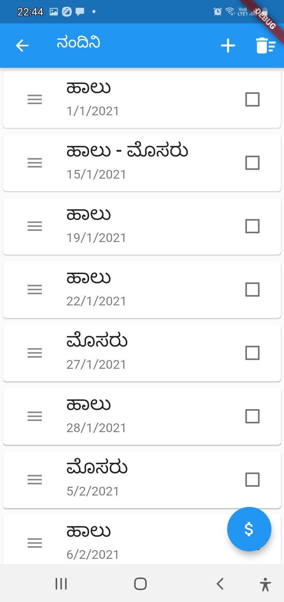
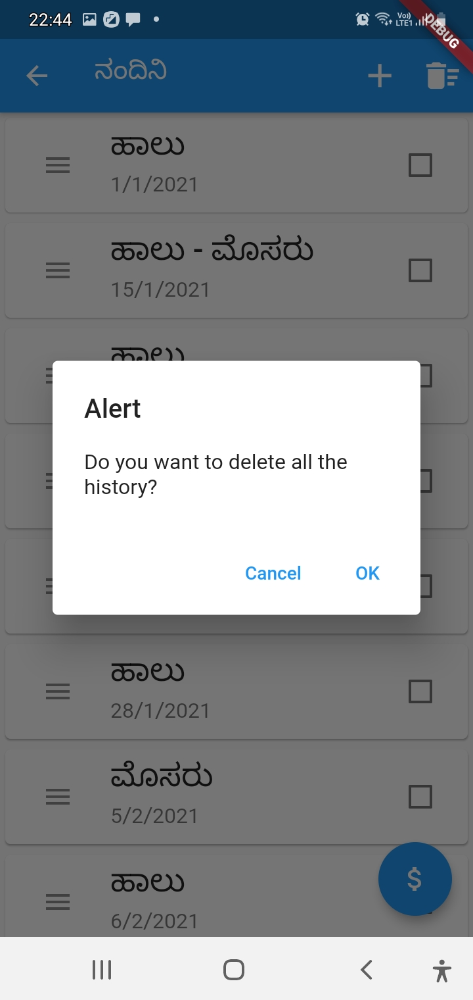
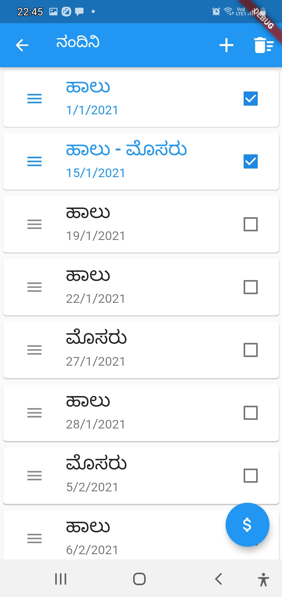
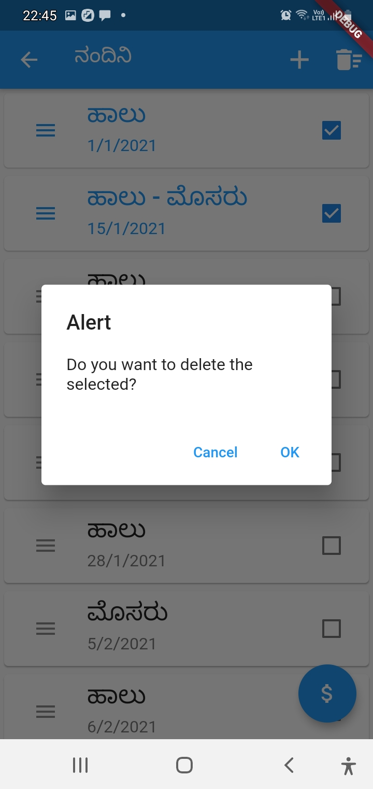
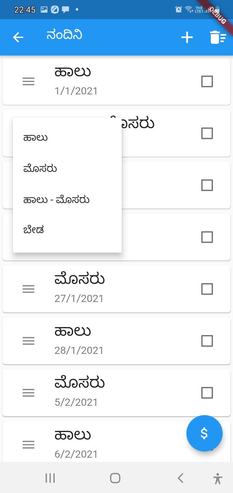
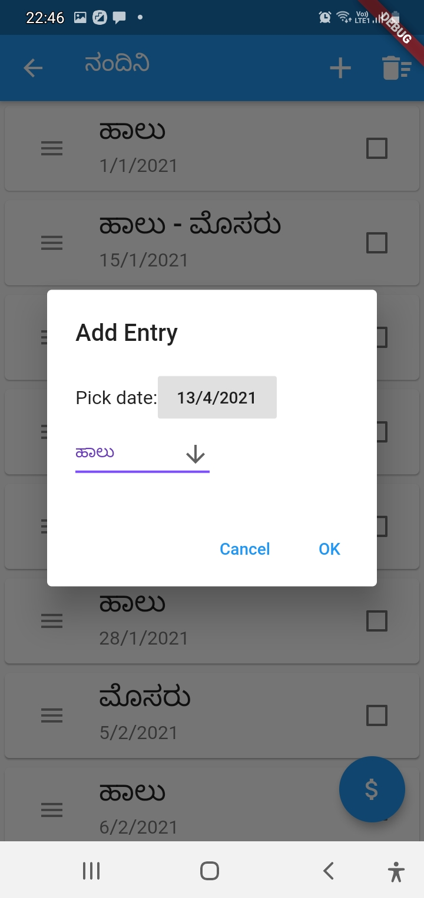
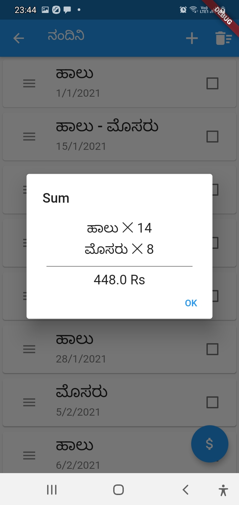
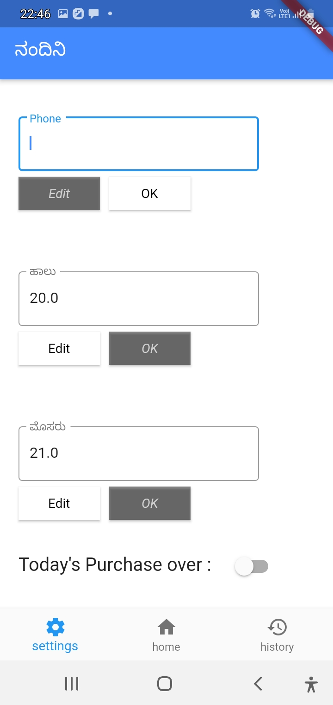
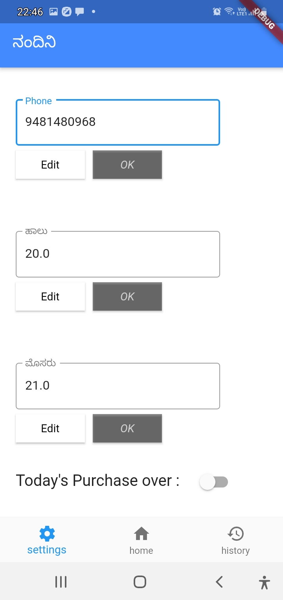
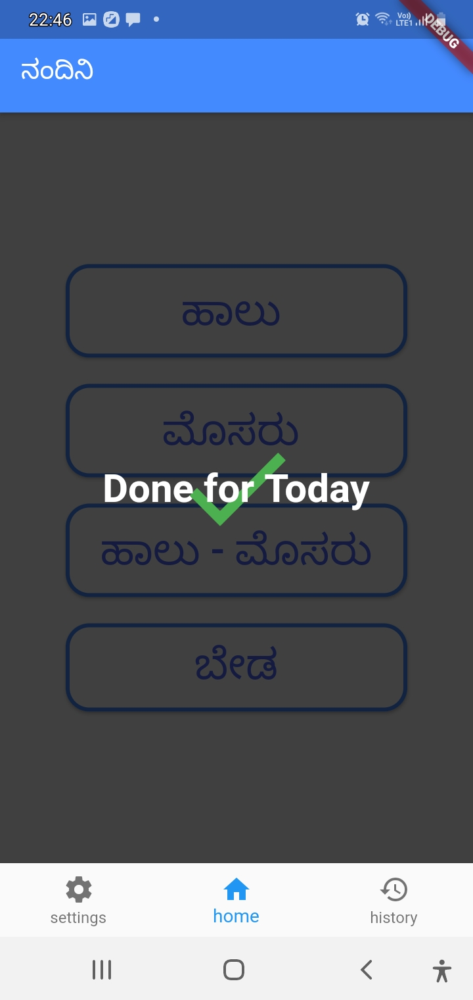

# daily_app

An app to handle daily order for dairy.

## Screen shots

Centered text

 home 

  

 
 
 

<em> history </em>

 
 
 

<em> deleteAll </em>

 
 
 

<em> selection </em>

 
 
 

<em> deleteSelected </em>

 
 
 

<em> modifyOption </em>

 
 
 

<em> addEntry </em>

 
 
 

<em> calculateSum </em>

 
 
 

<em> settings </em>

 
 
 

<em> editVariables </em>

 
 
 

<em> doneForTheDay </em>

 
 
 

